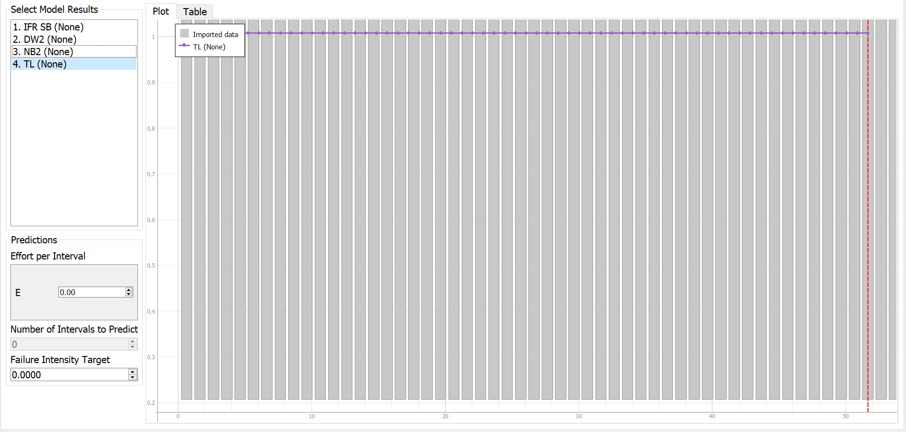

**SENG 438- Software Testing, Reliability, and Quality**

**Lab. Report \#5 – Software Reliability Assessment**

| Group \#:       |   |
|-----------------|---|
| Student Names:  | Sahil Bhatt  |
|                 | Harshal Patel |
|                 | Siwon Kim  |
|                 | Abhiraam Manchiraju  |

# Introduction
In this assignment, we learned to determine the reliability of a hypothetical system using its integration testing failure data. We were introduced to the use of reliability growth testing, and reliability assessment with Reliability Demonstration Charts. The applications we used were C-SFRAT and SRTAT, two applications which are reliability growth assessment tools. 

Throughout this lab, we understood the utility and usage of reliability growth testing, and learned how to measure failure rate, mean time to failure, and the reliability of a SUT via failure test data analysis, and learned the configurations for two different reliability growth assessment tools.

# Assessment Using Reliability Growth Testing 

## **Result of Model Comparison**
C-SFRAT was used for this portion of the lab. To use this software, we were required to convert one of the many provided failure report .docx files into a .csv file. We chose to move forward with failure report 7 and constructed a csv file based on the information that was provided. After running the various models against our dataset, we chose the top two models by comparing log-likelihood values as this value would help to determine the best fit. With this in mind, we chose 2 models that had the highest log-likelihood. From our results, we saw that TL and NB2 were the top 2 models with log-likelihoods of -65.000 and -68.802 respectivley.

## **Result of Range Analysis**

## **Plots for Failure Rate and Reliability of the SUT**

**MVF Graph for TL**

**MVF Graph for NB2**

**Intensity Graph for TL**

**Intensity Graph for NB2**

**Reliability Graph (SRTAT) based on Littlewood and Varral's Bayesian Reliability**

## **A discussion on decision making given a target failure rate**

## **Advantages and Disadvantages of reliability growth analysis**
**Advantages**
- Provides quantitative computations and results on the reliability of the system
- Produced graphs show time-dependent trends -- can be used to predict future data behaviour and make decisions

**Disadvantages**
- Tools that are used, particularly in this lab, can be considered outdated and may not reflect and support new functionalities from recent developments
- Predictions can vary based on the model that is used -- no universal form of prediction 
- Different tools use different forms of data -- can be tedious to move data from one form to another for the sake of using a different tool

# Assessment Using Reliability Demonstration Chart 

## **3 Plots for MTTFmin, Half and Twice**

### **MTTFmin**

This image shows the plot for MTTFmin. MTTFmin was derived through trial and error and was calculated to be 100 / 132000 = 0.00076. While a majority of the points intially fall in the reject range, this MTTF value allows the system to just barely pass the acceptance threshold.

### **Half MTTFmin**

This image shows the plot for 1/2 * MTTFmin. Given MTTFmin, this half amount was calculated to be 50 / 132000 = 0.00039. It can be seen that with this value as the MTTF, all data points fall in the rejection area which aligns with the changes as the number of allowed failures was reduced

### **Double MTTFmin**

This image shows the plot for 2 * MTTFmin. GIven MTTFmin, this doubled amount was calculated to be 200 / 132000 = 0.0015. It can be seen that with this value as the MTTF, all a majority of the data points fall in the acceptance area with a small intial set of data falling in the continue range. This aligns with the changes as the number of allowed failures was increased

## **Evaluation and Justification of MTTFmin**
As seen in the first graph above, the MTTFmin we decided on was 100 / 132000 = 0.00076. This value was found through the process of trial and error of trying various values until the last point on the graph just barely entered the acceptance region. The calculation for MTTFmin represents a ratio -- 100 maximum failures per 132000 input events. While experimenting with MTTF values, we saw that smaller MTTF values resulted in the points shifting more to the left, towards the rejection region while larger MTTF values resulted in the points shifting further to the right, towards the acceptance region. To determine MTTFmin, we decided to leave the risk trade-off parameters as their default values.

## **Advantages and Disadvantages of RDC**
**Advantages**
- In theory, this provides a low cost method for calculating and determining system reliabiity as no complicated software is required.
- Low cost attribute can also aid in a faster decisions as visuals can quickly determine if the product should be tested further

**Disadvantage**
- Viewing a visual in the form of a graph may not provide the most precise form of tracking these metrics. 
- Playing around with MTTFmin to meet RDC criteria and create a graph that made sense required a lot of trial-and-error/guess-and-check work

# Comparison of Results

# Discussion on Similarity and Differences of the Two Techniques
One major similarity between the two techniques is that they both assess data based on the two key factors of failure time and failure intensity. With this, the same reliability data can be used for both techniques (ignoring different formats of date). After factoring in the reliability based on the results from these two techniques, we can determine if the system is ready for release or would require further testing.

One major difference between the two techniques is the overall results that are determined by each technique. With reliability growth testing, we saw the tools produce quantitative data on reliability which could then be assessed further with the various produced graphs. With RDC, we only saw a visual graph for which the sole purpose was to determine whether the system falls into rejection, continue testing, or accepted. RDC also allows for further experimentation by changing the various factors such as risk trade-off paramters and MTTF.

# How the team work/effort was divided and managed
For this lab, we split up based on the sections, as we used different applications for each one. For the first one, we used C-SFRAT and Abhiraam and Harshal worked on it. For the second part, we used SRTAT and Siwon and Sahil worked on it. 

# Difficulties encountered, challenges overcome, and lessons learned
For this lab we encountered many difficulties, such as understanding the instructions and getting the downloaded programs to function. Once we somewhat understood what we needed to download, we proceeded to do so, however encountered trouble as the instructions were very unclear and vague. Additionally, we had trouble configuring the programs, and had trouble understanding what exactly we needed to do. We overcame this by reading through the lecture notes, watching youtube videos to learn how to configure the programs, and testing different things until we got what we needed.

# Comments/feedback on the lab itself
The instructions given in this lab were very vague and provided almost no insight into what was required to submit. Further, the various applications that were used in this lab were quite unintuituve with little instructions on configuration and some applications not working on particular systems.
